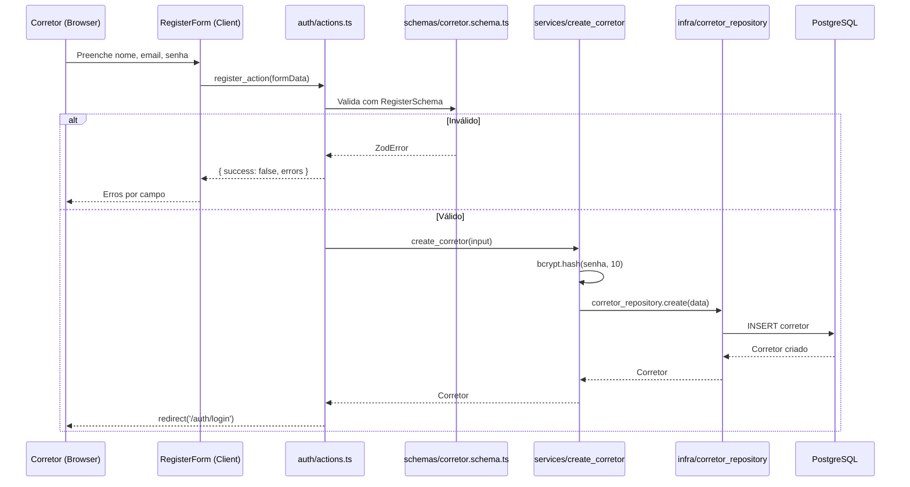
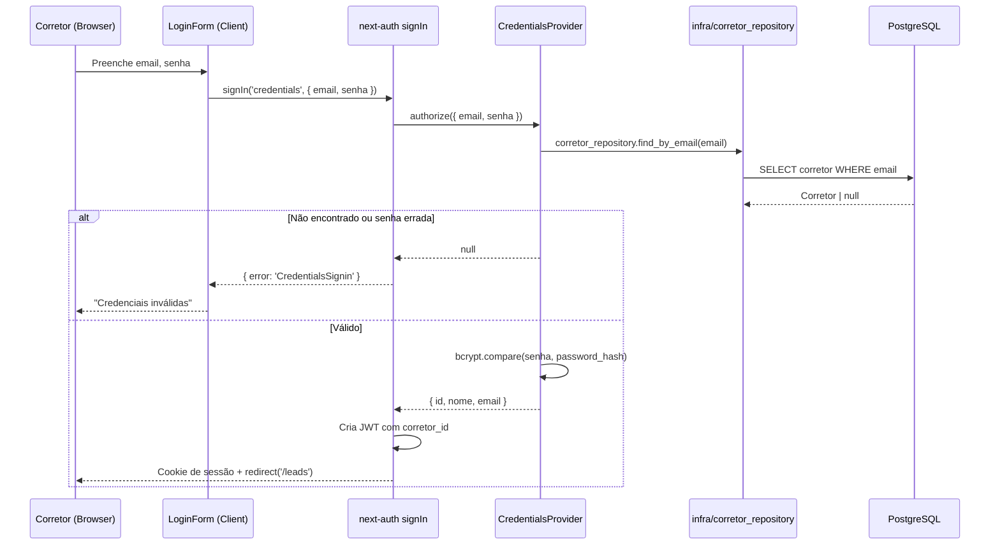
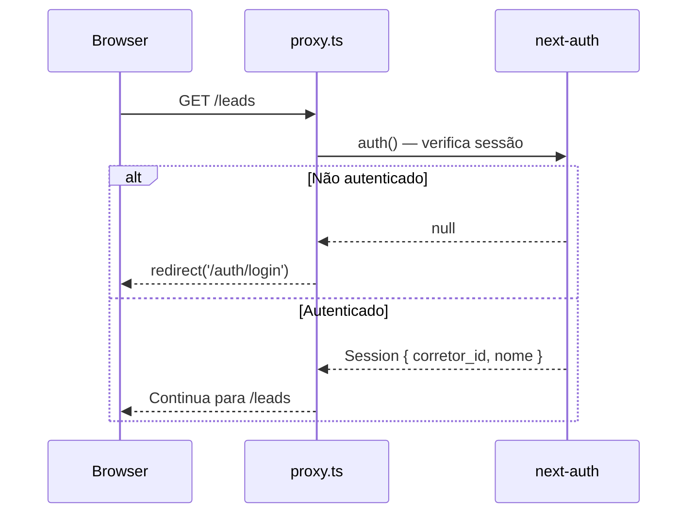

# Documento de Design Técnico — Autenticação de Corretores

## Visão Geral

Implementação de autenticação mínima para o LeadImobi usando **next-auth v5** com `CredentialsProvider`. Cada corretor possui conta própria e acessa apenas seus leads. A sessão é armazenada em cookie JWT httpOnly gerenciado pelo next-auth.

A implementação segue a arquitetura em camadas existente: novos tipos em `types/`, schemas Zod em `schemas/`, serviços em `services/`, repositório em `infra/`, e rotas/actions em `app/`.

---

## Arquitetura

### Diagrama de Camadas — Auth

```mermaid
graph TD
    subgraph "app/ — Rotas e Server Actions"
        A1[auth/login/page.tsx]
        A2[auth/register/page.tsx]
        A3[auth/actions.ts]
        A4[api/auth/[...nextauth]/route.ts]
        A5[layout.tsx leads — com SessionProvider]
    end

    subgraph "components/"
        C1[login_form.tsx]
        C2[register_form.tsx]
        C3[logout_button.tsx]
    end

    subgraph "schemas/"
        S1[corretor.schema.ts]
    end

    subgraph "services/"
        SV1[create_corretor.ts]
    end

    subgraph "infra/repositories/"
        I1[corretor_repository.ts]
    end

    subgraph "types/"
        T1[corretor.ts]
    end

    subgraph "lib/"
        L1[auth.ts — next-auth config]
        L2[session.ts — helper get_session]
    end

    A1 --> C1
    A2 --> C2
    A3 --> S1
    A3 --> SV1
    A4 --> L1
    A5 --> C3
    C1 --> L1
    SV1 --> I1
    I1 --> T1
    L1 --> I1
    L2 --> L1
```

### Fluxo — Cadastro de Corretor



### Fluxo — Login



### Fluxo — Proteção de Rota (proxy.ts)



---

## Componentes e Interfaces

### Dependências a instalar

```bash
npm install next-auth@beta bcryptjs
npm install --save-dev @types/bcryptjs
```

> **next-auth v5** (beta) é a versão compatível com Next.js 15/16 App Router. O pacote é `next-auth@beta`.

---

### `lib/auth.ts` — Configuração do next-auth

Arquivo central de configuração do next-auth. Exporta `{ handlers, auth, signIn, signOut }`.

```typescript
// src/lib/auth.ts
import NextAuth from 'next-auth'
import Credentials from 'next-auth/providers/credentials'
import bcrypt from 'bcryptjs'
import { corretor_repository } from '@/infra/repositories/corretor_repository'

export const { handlers, auth, signIn, signOut } = NextAuth({
  providers: [
    Credentials({
      credentials: {
        email: { label: 'E-mail', type: 'email' },
        senha: { label: 'Senha', type: 'password' },
      },
      async authorize(credentials) {
        if (!credentials?.email || !credentials?.senha) return null
        const corretor = await corretor_repository.find_by_email(
          credentials.email as string
        )
        if (!corretor) return null
        const valid = await bcrypt.compare(
          credentials.senha as string,
          corretor.password_hash
        )
        if (!valid) return null
        return { id: corretor.id, name: corretor.nome, email: corretor.email }
      },
    }),
  ],
  callbacks: {
    jwt({ token, user }) {
      if (user) token.corretor_id = user.id
      return token
    },
    session({ session, token }) {
      session.user.corretor_id = token.corretor_id as string
      return session
    },
  },
  pages: {
    signIn: '/auth/login',
  },
  session: { strategy: 'jwt', maxAge: 7 * 24 * 60 * 60 }, // 7 dias
})
```

---

### `lib/session.ts` — Helper de sessão

Função utilitária para obter a sessão em Server Components e Server Actions, com throw se não autenticado.

```typescript
// src/lib/session.ts
import { auth } from '@/lib/auth'
import { redirect } from 'next/navigation'

export async function get_session() {
  const session = await auth()
  if (!session?.user?.corretor_id) redirect('/auth/login')
  return session
}
```

---

### `types/corretor.ts` — Tipos compartilhados

```typescript
export interface Corretor {
  id: string
  nome: string
  email: string
  created_at: Date
}

export interface CorretorWithHash extends Corretor {
  password_hash: string
}

export interface CreateCorretorInput {
  nome: string
  email: string
  senha: string
}
```

---

### `schemas/corretor.schema.ts` — Validação Zod

```typescript
export const RegisterSchema = z.object({
  nome: z.string().min(2).max(100),
  email: z.string().email(),
  senha: z.string().min(8),
})

export const LoginSchema = z.object({
  email: z.string().email(),
  senha: z.string().min(1),
})
```

---

### `infra/repositories/corretor_repository.ts`

```typescript
const corretor_repository = {
  create(data: { nome: string; email: string; password_hash: string }): Promise<Corretor>,
  find_by_email(email: string): Promise<CorretorWithHash | null>,
  find_by_id(id: string): Promise<Corretor | null>,
}
```

Captura erro Prisma `P2002` (email duplicado) e lança `{ error: 'EMAIL_ALREADY_EXISTS' }`.

---

### `services/create_corretor.ts`

```typescript
async function create_corretor(input: CreateCorretorInput): Promise<Corretor>
```

Responsabilidades:
1. Fazer hash da senha com `bcrypt.hash(input.senha, 10)`
2. Chamar `corretor_repository.create({ nome, email, password_hash })`
3. Propagar `EMAIL_ALREADY_EXISTS` sem transformação

---

### Ajustes na camada `infra/` — Lead Repository

O `lead_repository` precisa receber `corretor_id` em todas as operações:

```typescript
const lead_repository = {
  create(data: CreateLeadData & { corretor_id: string }): Promise<Lead>,
  find_all(corretor_id: string): Promise<Lead[]>,
  find_by_id(id: string, corretor_id: string): Promise<Lead | null>,
  update(id: string, corretor_id: string, data: UpdateLeadData): Promise<Lead>,
  delete(id: string, corretor_id: string): Promise<void>,
}
```

`find_by_id`, `update` e `delete` incluem `corretor_id` no `WHERE` — se o lead não pertencer ao corretor, retornam `null` / lançam not found (sem revelar existência).

---

### Ajustes nos Services de Lead

Todos os services de lead recebem `corretor_id` como parâmetro adicional:

```typescript
create_lead(repository, input, corretor_id: string): Promise<Lead>
list_leads(repository, corretor_id: string): Promise<Lead[]>
update_lead(repository, id, input, corretor_id: string): Promise<Lead>
delete_lead(repository, id, corretor_id: string): Promise<void>
```

---

### `app/api/auth/[...nextauth]/route.ts`

```typescript
import { handlers } from '@/lib/auth'
export const { GET, POST } = handlers
```

---

### `proxy.ts` — Proteção de rotas

```typescript
import { auth } from '@/lib/auth'

export function proxy(request: Request) {
  // Protege /leads/* — redireciona para login se não autenticado
  // Redireciona /auth/* para /leads se já autenticado
}

export const config = {
  matcher: ['/leads/:path*', '/auth/:path*'],
}
```

---

### Componentes de UI

#### `components/login_form.tsx` — Client Component
- Campos: E-mail, Senha
- Chama `signIn('credentials', ...)` do next-auth
- Exibe erro genérico em caso de falha
- Link para `/auth/register`

#### `components/register_form.tsx` — Client Component
- Campos: Nome, E-mail, Senha
- Chama Server Action `register_action`
- Exibe erros por campo
- Link para `/auth/login`

#### `components/logout_button.tsx` — Client Component
- Botão que chama `signOut()` do next-auth
- Exibe nome do corretor autenticado

---

## Modelo de Dados

### Alterações no Schema Prisma

```prisma
model Corretor {
  id            String   @id @default(cuid())
  nome          String
  email         String   @unique
  password_hash String
  created_at    DateTime @default(now())
  leads         Lead[]

  @@map("corretores")
}

model Lead {
  id           String       @id @default(cuid())
  corretor_id  String                          // ← novo campo
  corretor     Corretor     @relation(fields: [corretor_id], references: [id])
  nome         String
  email        String
  cpf          String
  telefone     String
  valor_imovel Decimal      @db.Decimal(15, 2)
  renda_mensal Decimal      @db.Decimal(15, 2)
  score        Decimal?     @db.Decimal(8, 2)
  priority     LeadPriority
  created_at   DateTime     @default(now())

  @@unique([cpf, corretor_id])               // ← CPF único por corretor
  @@map("leads")
}
```

**Decisões de design:**
- `email` do `Lead` deixa de ser `@unique` global — dois corretores podem ter leads com o mesmo email de cliente
- `cpf` do `Lead` passa a ser único **por corretor** (`@@unique([cpf, corretor_id])`), não globalmente
- `password_hash` nunca é exposto fora do `corretor_repository`

---

## Extensão de Tipos do next-auth

Para que `session.user.corretor_id` seja tipado corretamente, é necessário declarar o módulo:

```typescript
// src/types/next-auth.d.ts
import 'next-auth'

declare module 'next-auth' {
  interface Session {
    user: {
      corretor_id: string
      name?: string | null
      email?: string | null
    }
  }
}

declare module 'next-auth/jwt' {
  interface JWT {
    corretor_id?: string
  }
}
```

---

## Tratamento de Erros

| Situação | Comportamento |
|---|---|
| Email já cadastrado no registro | Mensagem genérica (não revelar existência) |
| Credenciais inválidas no login | Mensagem genérica (não revelar qual campo) |
| Sessão expirada | Redirecionamento automático para `/auth/login` |
| Lead de outro corretor acessado | 404 (não revelar existência) |
| Banco indisponível no cadastro | Mensagem genérica, log interno |

---

## Estratégia de Migração

A adição de `corretor_id` em `leads` é uma **breaking change** no banco existente. A migration deve:

1. Criar a tabela `corretores`
2. Adicionar coluna `corretor_id` em `leads` como nullable temporariamente
3. (Opcional para dev) Criar um corretor padrão e associar leads existentes
4. Tornar `corretor_id` NOT NULL após associação
5. Remover `@unique` de `email` e `cpf` em `leads`, adicionar `@@unique([cpf, corretor_id])`

Em desenvolvimento, `prisma migrate reset` é a abordagem mais simples.

---

## Segurança

- Senhas armazenadas com bcrypt, custo 10 (≈100ms por hash — adequado para v1)
- Cookie JWT httpOnly — não acessível via JavaScript no browser
- Mensagens de erro genéricas em login/cadastro (prevenção de enumeração)
- `corretor_id` sempre vem da sessão do servidor, nunca do cliente
- Todas as queries de lead incluem `corretor_id` no WHERE — isolamento garantido no banco
