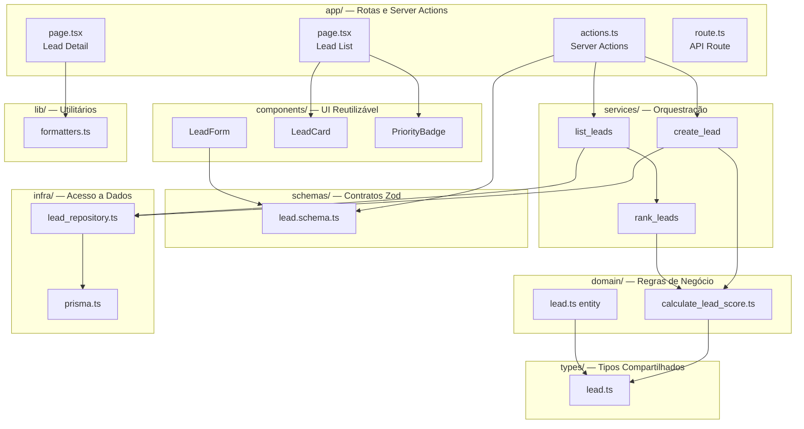
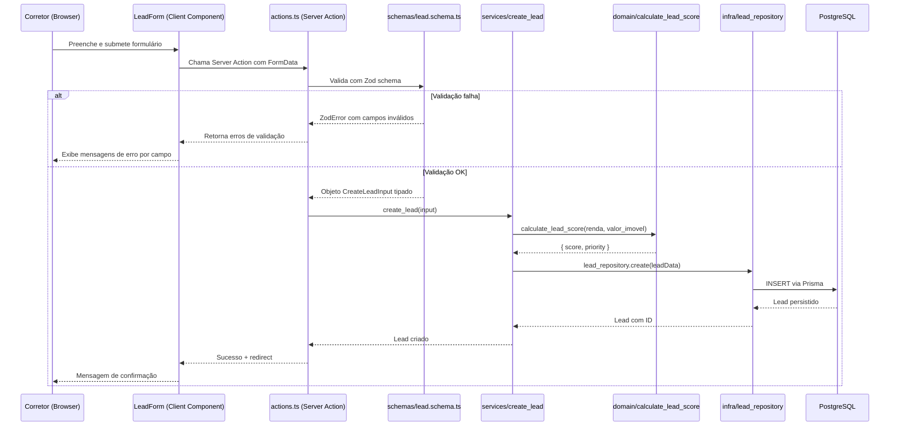
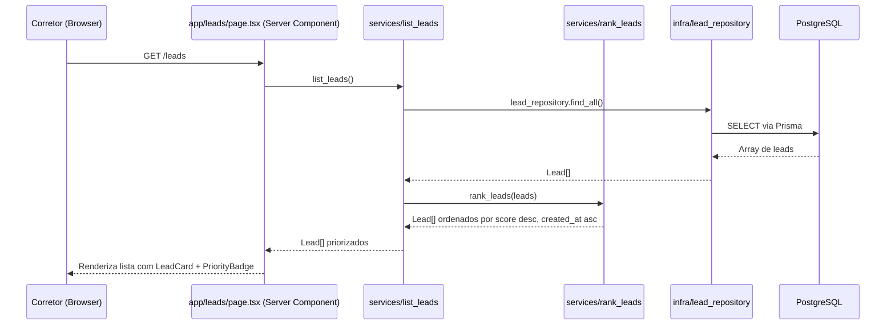

# Documento de Design Técnico — LeadImobi Core

## Visão Geral

O LeadImobi Core é uma aplicação monolítica modular construída com Next.js (App Router) que centraliza o cadastro de leads imobiliários, calcula automaticamente um Índice de Qualificação Financeira e exibe uma lista priorizada para corretores.

A arquitetura segue o padrão de separação em camadas com fronteiras bem definidas: a camada `domain/` contém as regras de negócio puras e independentes de frameworks; a camada `services/` orquestra os casos de uso; a camada `infra/` isola o acesso a dados; e a camada `app/` gerencia rotas, Server Actions e renderização.

### Objetivos de Design

- **Testabilidade**: domínio isolado de frameworks permite testes unitários e de propriedade sem mocks de infraestrutura
- **Manutenibilidade**: cada camada tem responsabilidade única e bem delimitada
- **Consistência**: TypeScript strict em todo o projeto, sem `any`
- **Simplicidade**: monolito modular adequado para v1, sem over-engineering

---

## Arquitetura

### Diagrama de Camadas



### Fluxo de Dados — Cadastro de Lead



### Fluxo de Dados — Listagem Priorizada



---

## Componentes e Interfaces

### Camada `domain/`

#### `calculate_lead_score.ts`

Função pura que encapsula toda a lógica de cálculo e classificação do Índice de Qualificação Financeira. Não possui dependências externas — recebe apenas tipos primitivos e retorna um tipo definido em `types/`.

**Responsabilidades:**
- Calcular o índice: `((renda_mensal × 12 × 5) ÷ valor_imovel) × 100`
- Arredondar para 2 casas decimais
- Classificar em `Alto`, `Médio`, `Baixo` ou `NaoClassificado`
- Tratar entradas inválidas (zero, nulo) sem lançar exceções

**Interface:**
```typescript
// Entrada: tipos primitivos apenas
function calculate_lead_score(
  renda_mensal: number,
  valor_imovel: number
): LeadScoreResult

// Retorno
type LeadScoreResult =
  | { valid: true; score: number; priority: LeadPriority }
  | { valid: false; priority: 'NaoClassificado' }
```

#### `lead.ts` (entity)

Representa a entidade de domínio Lead com seus invariantes. Não depende de Prisma ou Zod.

**Invariantes da entidade Lead:**

1. **Email normalizado** — o campo `email` SHALL ser armazenado e comparado sempre em lowercase. A normalização ocorre na entidade antes de qualquer persistência, garantindo que `Ana@Email.com` e `ana@email.com` sejam tratados como o mesmo endereço.

2. **Score arredondado** — quando `valid: true`, o campo `score` SHALL conter sempre um número arredondado para exatamente 2 casas decimais. Um score com mais casas decimais é considerado inválido como invariante da entidade.

3. **Consistência entre score e priority** — os campos `score` e `priority` SHALL ser mutuamente consistentes:
   - `score >= 80` → `priority === 'Alto'`
   - `score >= 40 && score < 80` → `priority === 'Medio'`
   - `score > 0 && score < 40` → `priority === 'Baixo'`
   - `score === null` → `priority === 'NaoClassificado'`
   - Nenhuma combinação fora dessas é válida como estado da entidade.

4. **Valores financeiros positivos** — `valor_imovel` e `renda_mensal` SHALL ser maiores que zero quando a entidade é considerada válida para classificação.

5. **ID imutável** — o campo `id` não pode ser alterado após a criação da entidade.

**Responsabilidade de garantia dos invariantes:**

Os invariantes 1 (normalização de email) e 3 (consistência score/priority) são garantidos pela função `calculate_lead_score` no momento do cálculo e pela função `create_lead` no momento da criação. A entidade `lead.ts` expõe uma função `validate_lead_invariants` que pode ser usada em testes para verificar que um objeto `Lead` satisfaz todos os invariantes acima.

---

### Camada `services/`

#### `create_lead.ts`

Orquestra o caso de uso de criação de lead: recebe dados validados, calcula o score via domínio, persiste via repositório.

**Interface:**
```typescript
async function create_lead(input: CreateLeadInput): Promise<Lead>
```

**Dependências:** `calculate_lead_score` (domain), `lead_repository` (infra)

#### `list_leads.ts`

Recupera todos os leads e delega a ordenação para `rank_leads`.

**Interface:**
```typescript
async function list_leads(): Promise<Lead[]>
```

**Dependências:** `lead_repository` (infra), `rank_leads` (service)

#### `rank_leads.ts`

Função pura de ordenação: ordena leads por score decrescente, com desempate por `created_at` crescente. Leads `NaoClassificado` vão ao final.

**Interface:**
```typescript
function rank_leads(leads: Lead[]): Lead[]
```

**Dependências:** nenhuma (função pura sobre tipos de `types/`)

---

### Camada `infra/`

#### `lead_repository.ts`

Abstrai o acesso ao banco de dados. Única camada que conhece o Prisma Client.

**Interface:**
```typescript
const lead_repository = {
  create(data: CreateLeadData): Promise<Lead>,
  find_all(): Promise<Lead[]>,
  find_by_id(id: string): Promise<Lead | null>,
}
```

#### `prisma.ts`

Singleton do Prisma Client para evitar múltiplas conexões em ambiente de desenvolvimento com hot-reload do Next.js.

---

### Camada `schemas/`

#### `lead.schema.ts`

Define o schema Zod para validação de entrada do formulário de cadastro. Os tipos TypeScript são derivados do schema via `z.infer<>`.

**Schemas definidos:**
- `CreateLeadSchema` — validação completa do formulário
- `CreateLeadInput` — tipo derivado via `z.infer<typeof CreateLeadSchema>`

---

### Camada `types/`

#### `lead.ts`

Tipos TypeScript compartilhados entre todas as camadas. Não contém lógica.

**Tipos definidos:**
```typescript
type LeadPriority = 'Alto' | 'Medio' | 'Baixo' | 'NaoClassificado'

interface Lead {
  id: string
  nome: string
  email: string
  telefone: string
  valor_imovel: number
  renda_mensal: number
  score: number | null
  priority: LeadPriority
  created_at: Date
}

interface CreateLeadInput {
  nome: string
  email: string
  telefone: string
  valor_imovel: number
  renda_mensal: number
}

interface LeadScoreResult {
  valid: boolean
  score: number | null
  priority: LeadPriority
}
```

---

### Camada `components/`

#### `LeadForm`

Client Component. Gerencia estado do formulário, chama Server Action, exibe erros por campo e desabilita o botão durante submissão.

**Props:** nenhuma (formulário de criação)
**Estado interno:** `isPending` (via `useFormStatus` ou `useTransition`), erros de validação

#### `LeadCard`

Server Component. Exibe dados resumidos de um lead na lista: Nome, E-mail, Telefone, Índice formatado e `PriorityBadge`.

**Props:** `lead: Lead`

#### `PriorityBadge`

Server Component. Renderiza badge colorido baseado na prioridade.

**Props:** `priority: LeadPriority`
**Mapeamento visual:**
- `Alto` → badge verde, texto "Alto"
- `Medio` → badge amarelo, texto "Médio"
- `Baixo` → badge vermelho, texto "Baixo"
- `NaoClassificado` → badge cinza, texto "Não classificado"

---

### Camada `lib/`

#### `formatters.ts`

Funções puras de formatação sem dependência de estado ou framework.

**Funções:**
```typescript
// Formata valor monetário: 12000 → "R$ 12.000,00"
function format_currency(value: number): string

// Formata índice com 2 casas decimais: 90.0 → "90,00"
function format_score(value: number | null): string

// Formata data no padrão brasileiro: Date → "DD/MM/AAAA HH:MM"
function format_date(date: Date): string
```

---

### Camada `app/`

#### `app/leads/page.tsx`

Server Component. Chama `list_leads()` e renderiza a lista com `LeadCard` e `PriorityBadge`. Exibe contagem por classificação e estado vazio.

#### `app/leads/[id]/page.tsx`

Server Component. Chama `lead_repository.find_by_id(id)`, retorna 404 se não encontrado, renderiza `LeadDetail` com dados formatados via `lib/formatters`.

#### `app/leads/actions.ts`

Server Actions do Next.js. Recebe `FormData`, valida com Zod, chama `create_lead`, retorna resultado ou erros.

---

## Modelo de Dados

### Schema Prisma

```prisma
model Lead {
  id           String   @id @default(cuid())
  nome         String
  email        String   @unique
  telefone     String
  valor_imovel Decimal  @db.Decimal(15, 2)
  renda_mensal Decimal  @db.Decimal(15, 2)
  score        Decimal? @db.Decimal(8, 2)
  priority     String   // 'Alto' | 'Medio' | 'Baixo' | 'NaoClassificado'
  created_at   DateTime @default(now())

  @@map("leads")
}
```

**Decisões de design:**
- `Decimal` para valores monetários evita erros de ponto flutuante em armazenamento
- `score` é nullable para representar leads `NaoClassificado`
- `priority` como `String` no banco (não enum) para flexibilidade de evolução sem migrations
- `email` com `@unique` garante unicidade no nível do banco de dados
- `cuid()` como ID para IDs seguros e não sequenciais

### Mapeamento Prisma → Tipo TypeScript

O repositório converte `Decimal` do Prisma para `number` do TypeScript ao retornar dados, mantendo o domínio livre de tipos do Prisma.

```typescript
// infra/repositories/lead_repository.ts
function map_prisma_to_lead(prisma_lead: PrismaLead): Lead {
  return {
    ...prisma_lead,
    valor_imovel: prisma_lead.valor_imovel.toNumber(),
    renda_mensal: prisma_lead.renda_mensal.toNumber(),
    score: prisma_lead.score?.toNumber() ?? null,
    priority: prisma_lead.priority as LeadPriority,
  }
}
```

---

## Fluxos Principais

### Fluxo 1 — Cadastro de Lead

1. Corretor acessa `/leads/new` e preenche o `LeadForm`
2. Ao submeter, o Client Component chama a Server Action em `actions.ts`
3. A Server Action valida os dados com `CreateLeadSchema` (Zod)
4. Se inválido: retorna erros por campo, `LeadForm` exibe mensagens sem limpar os valores
5. Se válido: chama `create_lead(input)`
6. `create_lead` chama `calculate_lead_score(renda_mensal, valor_imovel)` no domínio
7. `create_lead` chama `lead_repository.create(...)` com score e priority calculados
8. Repositório persiste via Prisma; se email duplicado, Prisma lança `P2002` → service retorna erro descritivo
9. Server Action redireciona para `/leads` com mensagem de sucesso

### Fluxo 2 — Listagem Priorizada

1. Corretor acessa `/leads`
2. Server Component chama `list_leads()`
3. `list_leads` chama `lead_repository.find_all()`
4. `list_leads` passa o array para `rank_leads(leads)`
5. `rank_leads` ordena: score desc → created_at asc → NaoClassificado ao final
6. Server Component renderiza cada lead com `LeadCard` + `PriorityBadge`
7. Exibe contagem total e por classificação no topo da lista
8. Se lista vazia: exibe mensagem orientativa com botão "Cadastrar primeiro lead"

### Fluxo 3 — Visualização de Detalhe

1. Corretor clica em um `LeadCard` na lista
2. Navegação para `/leads/[id]`
3. Server Component chama `lead_repository.find_by_id(id)`
4. Se não encontrado: renderiza página 404 com link de retorno
5. Se encontrado: renderiza todos os dados com formatação via `lib/formatters`
   - Valores monetários: `format_currency(valor_imovel)`
   - Índice: `format_score(score)`
   - Data: `format_date(created_at)`
6. Exibe `PriorityBadge` com a classificação do lead
7. Link de retorno para `/leads`

---

## Correctness Properties

*A property is a characteristic or behavior that should hold true across all valid executions of a system — essentially, a formal statement about what the system should do. Properties serve as the bridge between human-readable specifications and machine-verifiable correctness guarantees.*

### Property 1: Determinismo do cálculo do índice

*Para qualquer* par válido de `(renda_mensal, valor_imovel)` com ambos maiores que zero, a função `calculate_lead_score` SHALL sempre retornar o mesmo score e a mesma priority — chamadas repetidas com os mesmos argumentos produzem resultados idênticos.

**Validates: Requirements LI-2.1.4**

---

### Property 2: Cobertura total e sem sobreposição da classificação

*Para qualquer* score válido (número positivo), a função `calculate_lead_score` SHALL retornar exatamente uma das três classificações (`Alto`, `Medio`, `Baixo`) — nunca duas ao mesmo tempo, nunca nenhuma.

**Validates: Requirements LI-2.3.4, LI-2.3.5**

---

### Property 3: Tratamento seguro de entradas inválidas

*Para qualquer* combinação onde `valor_imovel` ≤ 0 ou `renda_mensal` ≤ 0, a função `calculate_lead_score` SHALL retornar `{ valid: false, priority: 'NaoClassificado' }` sem lançar exceção.

**Validates: Requirements LI-2.2.1, LI-2.2.2, LI-2.2.5**

---

### Property 4: Consistência da fórmula de cálculo

*Para qualquer* par `(renda_mensal, valor_imovel)` com ambos maiores que zero, o score retornado por `calculate_lead_score` SHALL ser igual a `Math.round((renda_mensal * 12 * 5 / valor_imovel * 100) * 100) / 100` — verificável contra uma implementação de referência simples.

**Validates: Requirements LI-2.1.1, LI-2.1.2**

> **Nota de implementação:** A fórmula com parênteses explícitos é `((renda_mensal * 12 * 5) / valor_imovel) * 100`, garantindo que a divisão ocorre antes da multiplicação final por 100.

---

### Property 5: Ordenação estável da lista priorizada

*Para qualquer* array de leads, `rank_leads` SHALL retornar um array onde: (a) nenhum lead com score válido aparece após um lead `NaoClassificado`; (b) para quaisquer dois leads com score válido, o de maior score aparece primeiro; (c) para quaisquer dois leads com o mesmo score, o de `created_at` mais antigo aparece primeiro.

**Validates: Requirements LI-3.1.1, LI-3.1.2, LI-3.1.4**

---

### Property 6: Round-trip de formatação monetária

*Para qualquer* valor monetário positivo, `format_currency` SHALL produzir uma string que começa com `"R$ "` e contém exatamente uma vírgula separando os centavos com exatamente dois dígitos após ela.

**Validates: Requirements LI-4.2.1, LI-4.2.4**

---

### Property 7: Rejeição de entradas inválidas pelo schema Zod

*Para qualquer* objeto de entrada onde pelo menos um campo obrigatório está ausente, vazio, ou fora dos limites definidos, `CreateLeadSchema.safeParse` SHALL retornar `{ success: false }` com pelo menos um erro descritivo.

**Validates: Requirements LI-1.2.1, LI-1.2.2, LI-1.2.3, LI-1.2.4, LI-1.2.5, LI-1.2.8**

---

### Property 8: Aceitação de entradas válidas pelo schema Zod

*Para qualquer* objeto de entrada com todos os campos dentro dos limites válidos (nome 2–100 chars, email RFC 5322, telefone 10–15 dígitos, valor_imovel > 0, renda_mensal > 0), `CreateLeadSchema.safeParse` SHALL retornar `{ success: true }` com um objeto tipado livre de erros.

**Validates: Requirements LI-1.2.7, LI-5.1.1**

---

### Property 9: Consistência da lista após criação de lead

*Para qualquer* lead válido criado via `create_lead`, o array retornado por `list_leads` em chamada subsequente SHALL conter o novo lead e o resultado de `rank_leads` aplicado sobre esse array SHALL posicionar o novo lead na posição correta segundo os critérios de ordenação (score desc, created_at asc, NaoClassificado ao final).

**Validates: Requirements LI-3.1.3**

---

## Tratamento de Erros

### Erros de Validação (Zod)

- Ocorrem na camada `app/` antes de qualquer lógica de negócio
- Retornados como objeto `{ errors: Record<string, string[]> }` para o Client Component
- Cada campo inválido recebe sua mensagem descritiva
- O valor digitado pelo usuário é preservado

### Erros de Domínio

- `calculate_lead_score` nunca lança exceções — retorna `{ valid: false }` para entradas inválidas
- Domínio usa tipos de retorno discriminados em vez de exceções

### Erros de Infraestrutura

- `lead_repository` captura erros do Prisma e os converte em erros de domínio tipados
- Erro de unicidade de email (Prisma `P2002`) → `{ error: 'EMAIL_ALREADY_EXISTS' }`
- Erro de conexão → `{ error: 'DATABASE_UNAVAILABLE' }`
- Detalhes internos do Prisma nunca são expostos para a camada `app/`

### Erros de Rota

- Lead não encontrado por ID → Next.js `notFound()` → página 404 com link de retorno
- Erros inesperados em Server Actions → mensagem genérica ao usuário, log interno

### Hierarquia de Propagação

```
Browser → app/actions.ts → services/ → domain/ (sem exceções)
                                     → infra/ → Prisma (captura e converte)
```

---

## Estratégia de Testes

### Abordagem Dual

A estratégia combina testes de exemplo (unitários) para casos concretos e testes de propriedade (PBT) para verificar invariantes universais.

### Testes de Propriedade (PBT)

A feature é adequada para PBT porque:
- `calculate_lead_score` é uma função pura com espaço de entrada amplo (pares de números)
- `rank_leads` é uma função pura de ordenação com invariantes verificáveis
- `format_currency` é uma função pura com propriedades de formato verificáveis
- `CreateLeadSchema` tem fronteiras de validação verificáveis com inputs gerados

**Biblioteca recomendada:** `fast-check` (TypeScript/JavaScript)

**Configuração mínima:** 100 iterações por propriedade

**Tag de referência:** `// Feature: leadimobi-core, Property {N}: {texto da propriedade}`

**Propriedades a implementar como testes PBT:**
- Property 1: Determinismo do cálculo
- Property 2: Cobertura total e sem sobreposição
- Property 3: Tratamento seguro de entradas inválidas
- Property 4: Consistência da fórmula
- Property 5: Ordenação estável
- Property 6: Round-trip de formatação monetária
- Property 7: Rejeição de entradas inválidas
- Property 8: Aceitação de entradas válidas
- Property 9: Consistência da lista após criação de lead

### Testes de Exemplo (Unitários)

Focados em casos concretos e pontos de integração entre camadas:

**`domain/calculate_lead_score`:**
- Renda R$ 12.000, Imóvel R$ 400.000 → score 90,00, priority `Alto`
- Renda R$ 6.000, Imóvel R$ 380.000 → score 94,74, priority `Alto`
- Renda R$ 3.000, Imóvel R$ 450.000 → score 24,00, priority `Baixo`
- Valor_Imovel = 0 → `{ valid: false, priority: 'NaoClassificado' }`
- Renda_Mensal = 0 → `{ valid: false, priority: 'NaoClassificado' }`

**`services/rank_leads`:**
- Lista com Alto, Baixo, Médio → retorna Alto, Médio, Baixo
- Lista com NaoClassificado misturado → NaoClassificado vai ao final
- Lista vazia → retorna array vazio
- Dois leads com mesmo score → desempate por `created_at`

**`lib/formatters`:**
- `format_currency(12000)` → `"R$ 12.000,00"`
- `format_currency(400000)` → `"R$ 400.000,00"`
- `format_score(90)` → `"90,00"`
- `format_score(null)` → `"—"` (ou indicador de não classificado)
- `format_date(new Date('2024-01-15T10:30:00'))` → `"15/01/2024 10:30"`

**`schemas/lead.schema.ts`:**
- Nome com 1 caractere → erro
- Email sem @ → erro
- Telefone com 9 dígitos → erro
- Valor_Imovel negativo → erro
- Todos os campos válidos → sucesso com objeto tipado

### Testes de Integração

- `lead_repository.create` + Prisma (banco de teste ou mock)
- `create_lead` service completo (mock do repositório)
- Server Action com FormData válido e inválido

### Cobertura Prioritária

1. `domain/calculate_lead_score` — cobertura total (função crítica)
2. `services/rank_leads` — cobertura total (função pura)
3. `lib/formatters` — cobertura total (funções puras)
4. `schemas/lead.schema.ts` — fronteiras de validação
5. `services/create_lead` — fluxo principal com mock do repositório

---

## Decisões de Design e Trade-offs

### 1. Score calculado e persistido no cadastro

**Decisão:** O score e a priority são calculados no momento do cadastro e armazenados no banco.

**Alternativa considerada:** Calcular o score dinamicamente a cada leitura.

**Rationale:** Persistir o score simplifica a ordenação (query SQL direta), garante consistência histórica e evita recálculo em cada listagem. O trade-off é que mudanças na fórmula não retroagem automaticamente — aceitável para v1.

---

### 2. `rank_leads` como função pura em `services/`

**Decisão:** A ordenação é feita em memória por uma função pura, não via `ORDER BY` no SQL.

**Alternativa considerada:** Ordenar diretamente no Prisma com `orderBy`.

**Rationale:** Manter a lógica de ordenação em código TypeScript facilita testes de propriedade e mantém a regra de negócio (NaoClassificado ao final, desempate por data) explícita e testável. Para v1 com volume baixo de leads, a performance em memória é adequada.

---

### 3. `priority` como `String` no banco, não enum Prisma

**Decisão:** O campo `priority` é armazenado como `String` no PostgreSQL.

**Alternativa considerada:** Usar enum do Prisma (`enum LeadPriority { Alto Medio Baixo NaoClassificado }`).

**Rationale:** Enums no Prisma/PostgreSQL requerem migrations para adicionar valores. Usar String com validação em TypeScript oferece flexibilidade para v2+ sem custo de migration. A integridade é garantida pelo domínio antes da persistência.

---

### 4. Decimal no banco, number no domínio

**Decisão:** Prisma usa `Decimal` para valores monetários; o repositório converte para `number` ao retornar.

**Rationale:** `Decimal` evita erros de arredondamento no armazenamento. `number` no domínio mantém a camada de negócio simples e sem dependência do tipo `Decimal` do Prisma. A conversão ocorre exclusivamente no repositório.

---

### 5. Server Actions em vez de API Routes para mutações

**Decisão:** Cadastro de lead usa Server Action (`actions.ts`), não uma API Route.

**Rationale:** Server Actions integram naturalmente com formulários React, eliminam a necessidade de `fetch` manual no cliente e simplificam o tratamento de erros. API Routes (`route.ts`) ficam disponíveis para integrações futuras (v2+).

---

### 6. Singleton do Prisma Client

**Decisão:** `infra/db/prisma.ts` exporta um singleton do `PrismaClient`.

**Rationale:** O hot-reload do Next.js em desenvolvimento pode criar múltiplas instâncias do Prisma Client, esgotando o pool de conexões. O padrão singleton com `global` resolve isso sem impacto em produção.
