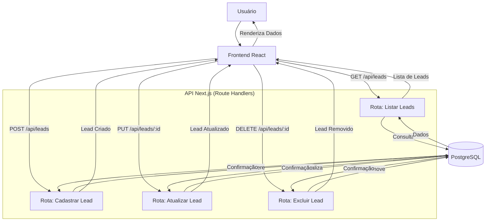

# Diagrama de Fluxo — LeadImobi

```mermaid
flowchart TD
    U[Usuário] --> F[Frontend React]

    F -->|GET /api/leads| R1[Rota: Listar Leads]
    F -->|POST /api/leads| R2[Rota: Cadastrar Lead]
    F -->|PUT /api/leads/:id| R3[Rota: Atualizar Lead]
    F -->|DELETE /api/leads/:id| R4[Rota: Excluir Lead]

    subgraph API["API Next.js (Route Handlers)"]
        R1
        R2
        R3
        R4
    end

    R1 -->|Consulta| D[(PostgreSQL)]
    R2 -->|Insere| D
    R3 -->|Atualiza| D
    R4 -->|Remove| D

    D -->|Dados| R1
    D -->|Confirmação| R2
    D -->|Confirmação| R3
    D -->|Confirmação| R4

    R1 -->|Lista de Leads| F
    R2 -->|Lead Criado| F
    R3 -->|Lead Atualizado| F
    R4 -->|Lead Removido| F

    F -->|Renderiza Dados| U
```
