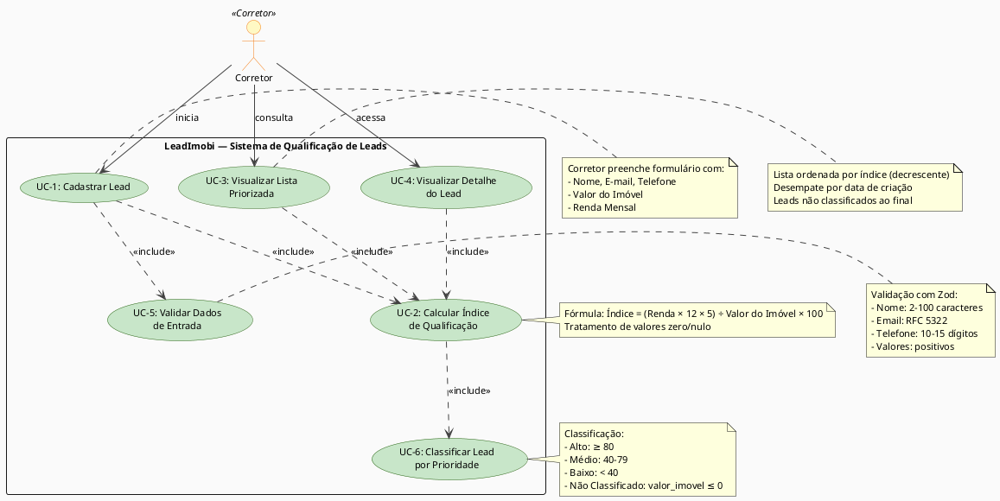

# Diagrama UML de Casos de Uso — LeadImobi

## Visão Geral

Este documento apresenta o diagrama UML de casos de uso do sistema LeadImobi, mapeando os atores, casos de uso principais e seus relacionamentos.

---

## Atores Identificados

| Ator | Descrição |
|------|-----------|
| **Corretor** | Usuário principal da plataforma que cadastra leads, visualiza a lista priorizada e acessa dados detalhados de cada lead para contato assertivo. |

---

## Casos de Uso

| ID | Caso de Uso | Descrição | Ator |
|---|---|---|---|
| **UC-1** | Cadastrar Lead | Corretor preenche formulário com dados pessoais e financeiros do lead | Corretor |
| **UC-2** | Calcular Índice de Qualificação | Sistema calcula automaticamente o índice baseado em renda e valor do imóvel | Sistema |
| **UC-3** | Visualizar Lista Priorizada | Corretor visualiza todos os leads ordenados por índice de qualificação | Corretor |
| **UC-4** | Visualizar Detalhe do Lead | Corretor acessa dados completos de um lead específico | Corretor |
| **UC-5** | Validar Dados de Entrada | Sistema valida os dados do formulário antes de processar | Sistema |
| **UC-6** | Classificar Lead por Prioridade | Sistema classifica o lead em Alto, Médio, Baixo ou Não Classificado | Sistema |

---

## Relacionamentos entre Casos de Uso

### Inclusões (<<include>>)

- **UC-1 inclui UC-5** — Cadastrar Lead sempre requer validação de dados
- **UC-1 inclui UC-2** — Cadastrar Lead sempre requer cálculo do índice
- **UC-2 inclui UC-6** — Calcular Índice sempre resulta em classificação de prioridade
- **UC-3 inclui UC-2** — Visualizar Lista Priorizada requer cálculo do índice para ordenação
- **UC-4 inclui UC-2** — Visualizar Detalhe do Lead requer cálculo do índice para exibição

---

## Diagrama PlantUML



---

## Fluxos Principais

### Fluxo 1: Cadastro de Lead (UC-1)

```
Corretor → UC-1 (Cadastrar Lead)
  ├─ UC-5 (Validar Dados de Entrada)
  │  └─ Se inválido: retorna erros por campo
  │  └─ Se válido: continua
  └─ UC-2 (Calcular Índice de Qualificação)
     └─ UC-6 (Classificar Lead por Prioridade)
        └─ Lead criado e persistido
```

**Resultado:** Lead cadastrado com índice calculado e classificação atribuída.

---

### Fluxo 2: Visualização de Lista Priorizada (UC-3)

```
Corretor → UC-3 (Visualizar Lista Priorizada)
  └─ UC-2 (Calcular Índice de Qualificação)
     └─ Leads ordenados por índice (decrescente)
        └─ Desempate por data de criação
           └─ Leads não classificados ao final
```

**Resultado:** Lista de leads exibida em ordem de prioridade com badges visuais.

---

### Fluxo 3: Visualização de Detalhe do Lead (UC-4)

```
Corretor → UC-4 (Visualizar Detalhe do Lead)
  └─ UC-2 (Calcular Índice de Qualificação)
     └─ Exibe todos os dados do lead com formatação
        └─ Índice, classificação e badge de prioridade
```

**Resultado:** Página de detalhe com informações completas do lead.

---

## Especificações dos Casos de Uso

### UC-1: Cadastrar Lead

**Ator:** Corretor

**Pré-condições:**
- Corretor está autenticado no sistema
- Formulário de cadastro está acessível

**Fluxo Principal:**
1. Corretor acessa a página de cadastro de lead
2. Preenche os campos: Nome, E-mail, Telefone, Valor do Imóvel, Renda Mensal
3. Clica no botão "Cadastrar"
4. Sistema valida os dados (UC-5)
5. Se válido, sistema calcula o índice (UC-2)
6. Sistema classifica o lead (UC-6)
7. Lead é persistido no banco de dados
8. Sistema exibe mensagem de confirmação
9. Corretor é redirecionado para a lista de leads

**Fluxo Alternativo (Validação Falha):**
- Se dados inválidos: sistema exibe erros por campo sem limpar os valores
- Corretor corrige os dados e resubmete

**Pós-condições:**
- Lead cadastrado com índice e classificação
- Lead aparece na lista priorizada

---

### UC-2: Calcular Índice de Qualificação

**Ator:** Sistema

**Pré-condições:**
- Renda Mensal e Valor do Imóvel fornecidos

**Fluxo Principal:**
1. Sistema recebe Renda Mensal e Valor do Imóvel
2. Aplica fórmula: `Índice = (Renda × 12 × 5) ÷ Valor do Imóvel × 100`
3. Arredonda para 2 casas decimais
4. Retorna índice calculado

**Fluxo Alternativo (Valores Inválidos):**
- Se Valor do Imóvel ≤ 0 ou Renda Mensal ≤ 0: retorna resultado inválido
- Lead é marcado como "Não Classificado"

**Pós-condições:**
- Índice calculado e disponível para classificação

---

### UC-3: Visualizar Lista Priorizada

**Ator:** Corretor

**Pré-condições:**
- Corretor está autenticado no sistema
- Pelo menos um lead foi cadastrado

**Fluxo Principal:**
1. Corretor acessa a página de leads
2. Sistema recupera todos os leads do banco de dados
3. Sistema calcula/recupera o índice de cada lead (UC-2)
4. Sistema ordena leads por índice (decrescente)
5. Desempate por data de criação (crescente)
6. Leads não classificados aparecem ao final
7. Sistema exibe a lista com badges de prioridade (Alto/Médio/Baixo/Não Classificado)
8. Corretor visualiza a lista priorizada

**Fluxo Alternativo (Lista Vazia):**
- Se nenhum lead cadastrado: exibe mensagem orientativa com botão "Cadastrar primeiro lead"

**Pós-condições:**
- Lista de leads exibida em ordem de prioridade

---

### UC-4: Visualizar Detalhe do Lead

**Ator:** Corretor

**Pré-condições:**
- Corretor está autenticado no sistema
- Lead existe no sistema

**Fluxo Principal:**
1. Corretor clica em um lead na lista
2. Sistema recupera dados completos do lead
3. Sistema calcula/recupera o índice (UC-2)
4. Sistema formata valores monetários (R$ X.XXX,XX)
5. Sistema formata data (DD/MM/AAAA HH:MM)
6. Sistema exibe página de detalhe com todos os dados
7. Corretor visualiza informações completas do lead

**Fluxo Alternativo (Lead Não Encontrado):**
- Se lead não existe: exibe página 404 com link de retorno

**Pós-condições:**
- Página de detalhe exibida com informações formatadas

---

### UC-5: Validar Dados de Entrada

**Ator:** Sistema

**Pré-condições:**
- Dados de entrada fornecidos pelo corretor

**Fluxo Principal:**
1. Sistema recebe dados do formulário
2. Valida Nome: string 2-100 caracteres
3. Valida E-mail: formato RFC 5322
4. Valida Telefone: 10-15 dígitos numéricos
5. Valida Valor do Imóvel: número positivo > 0
6. Valida Renda Mensal: número positivo > 0
7. Se todos válidos: retorna objeto tipado
8. Se algum inválido: retorna erros descritivos

**Pós-condições:**
- Dados validados ou erros identificados

---

### UC-6: Classificar Lead por Prioridade

**Ator:** Sistema

**Pré-condições:**
- Índice de Qualificação calculado

**Fluxo Principal:**
1. Sistema recebe índice calculado
2. Se Índice ≥ 80: classifica como "Alto" (🟢)
3. Se 40 ≤ Índice < 80: classifica como "Médio" (🟡)
4. Se 0 < Índice < 40: classifica como "Baixo" (🔴)
5. Se Índice inválido: classifica como "Não Classificado" (⚪)
6. Retorna classificação com badge visual

**Pós-condições:**
- Lead classificado com prioridade atribuída

---

## Mapeamento para Requisitos

| Caso de Uso | Requisitos Relacionados |
|---|---|
| UC-1 | LI-1.1, LI-1.2, LI-1.3 |
| UC-2 | LI-2.1, LI-2.2, LI-2.3 |
| UC-3 | LI-3.1, LI-3.2, LI-3.3 |
| UC-4 | LI-4.1, LI-4.2 |
| UC-5 | LI-5.1, LI-5.2 |
| UC-6 | LI-2.3 |

---

## Notas de Implementação

- Todos os casos de uso são implementados seguindo a arquitetura em camadas (app → services → domain → infra)
- Validação (UC-5) ocorre na camada `app/` antes de qualquer lógica de negócio
- Cálculo (UC-2) e Classificação (UC-6) ocorrem na camada `domain/` como funções puras
- Persistência ocorre na camada `infra/` via Prisma ORM
- Renderização ocorre na camada `app/` com Server Components e Client Components

---

## Referências

- [Documento de Requisitos](../specs/leadimobi-core/requirements.md)
- [Documento de Design Técnico](../specs/leadimobi-core/design.md)
- [Visão Geral do Produto](../steering/product.md)
